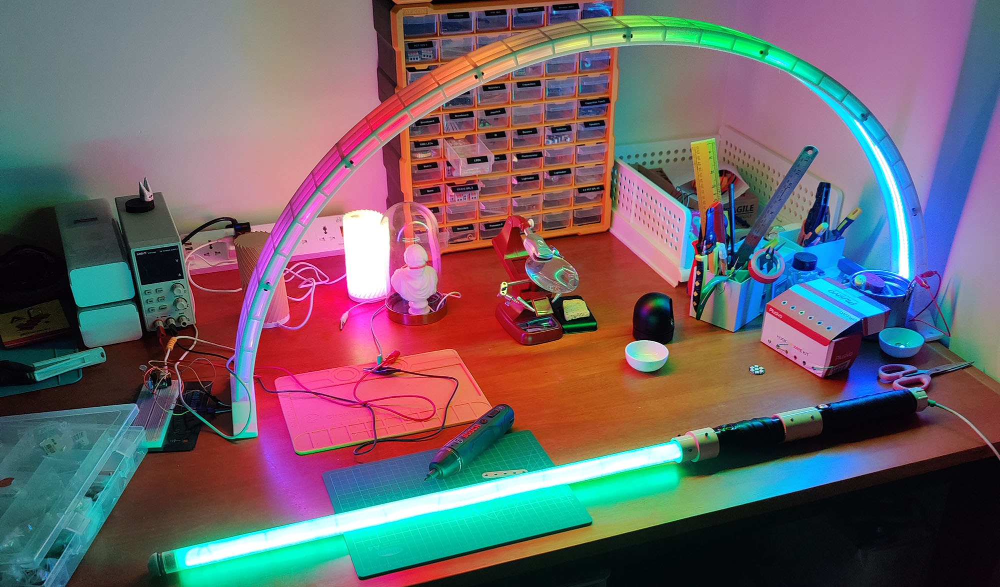
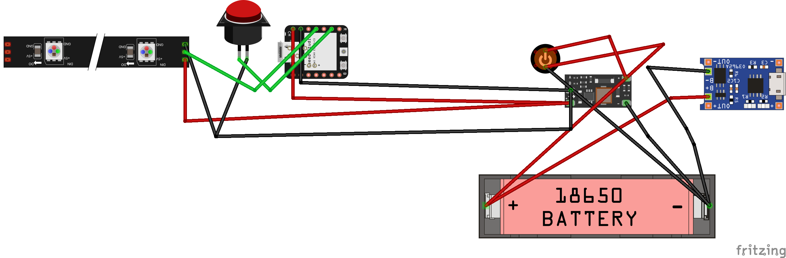

# Supersaber: Homage to the good ol' lightsaber!

## Overview
Welcome to the Supersaber repository! This codebase is the brain behind the Supersaber – an open-source lightsaber that's all about being one with the force. It's more than a prop; it's a technicolor dream sword!

## Features
- **NeoPixel LED Strip Control**: We're talking about a dazzling array of 188 LEDs, ready to display an array of colors that would make a rainbow jealous.
- **Dynamic Color Switching**: Bored of blue? Crave some crimson? Just press a button, and voilà! Color change on demand.
- **Power On/Off Effects**: This isn't just an on-off switch. It's an event. A spectacle. A mini light show in your hand every time you power up or down.
- **Pulsating Light Show (Future Feature)**: Currently just a twinkle in our eye, but soon, a pulsating extravaganza!

## Getting Started
1. **Assembly Required**: First, put together your Supersaber. If you're thinking, "But how?" – fear not! Imagine you're building a very shiny, very colorful, Jedi-approved jigsaw puzzle.

2. **Install Dependencies**: Make sure you have CircuitPython and necessary libraries like `neopixel` and `adafruit_debouncer`. No CircuitPython? No party!
3. **Deploy the Code**: Upload this script to your lightsaber's microcontroller. If you're feeling lost, just follow the path of least resistance (and most instructions).

## Usage
- **Power On**: A simple press, and the world is awash in color.
- **Change Color**: Feeling fickle? Tap the button, and shift the shade.
- **Power Off**: Done dazzling? A long press gently dims your blade.

## Contributing
Have an idea that's so absurd it just might work? We want to hear it! Whether it's a new color scheme that's out of this world or a feature that defies the laws of physics – bring it on.

## Disclaimer
This lightsaber won't actually cut through metal doors or deflect blaster bolts, but it will cut through the darkness and deflect boredom.

## License
Licensed under the "Do Whatever You Want But Sharing is Caring!" GPLv3 license. Use it, abuse it, remix it – but remember padawan, share the force!